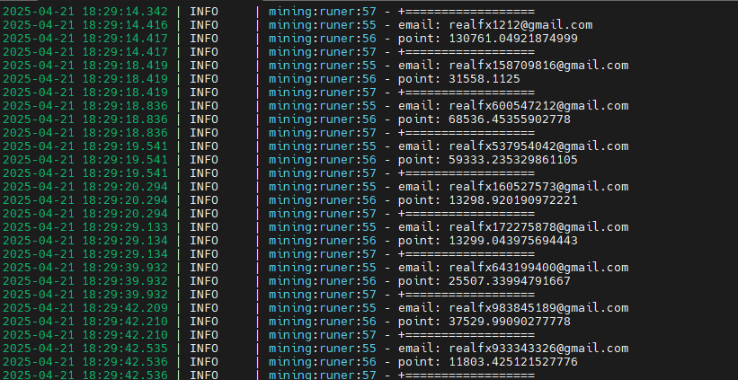
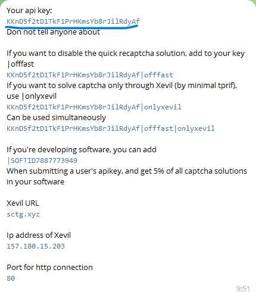
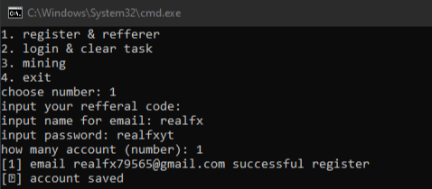

# Solix Auto Bot
<p align="center">
    
</p>

## Description
**Solix Auto Bot is an automation script to perform various tasks on the SolixDepin platform, such as registration, login, completing tasks, and mining.**
- Register : [HERE](https://dashboard.solixdepin.net/sign-up?ref=Y2R7vGC3)

## Features
1. **Register & Referer**: Register a new account with a referrer.
2. **Login & Clear Task**: Login to your account and complete available tasks.
3. **Mining**: Perform automatic mining to earn points.
4. **Captcha Solver**: Use API to solve captchas automatically.
5. **Batch Processing**: Process multiple accounts at once in batches using asynchronous programming.
6. **Bypass**: Free bypass turnstile captcha using free apikey

## Requirements
- Python 3.8 or latest

## Installation
1. Clone this repository:
   ```bash
   git clone https://github.com/realfx24/solix.git
   cd solix
   ```

2. Install dependencies:
   ```bash
   pip install -r requirements.txt
   ```

3. Create an `apikey.txt` file and fill API key from @Xevil_check_bot on telegram:
   ```bash
   @Xevil_check_bot
   ```
<p align="center">
    
</p>

4. Fill your account in accounts.json like this
   ```bash
   [
    {
        "email": "email@example.com",
        "password": "1234"
    },
    {
        "email": "email@example.com",
        "password": "1234"
    }
   ]
   ```

## How to use
1. Run the main script:
   ```bash
   python bot.py
   ```
   if in VPS or Linux:
   ```bash
   python3 bot.py
   ```

3. Select the available menu:
<p align="center">
    
</p>

4. Follow the instructions that appear in the terminal.

## Note
- Make sure the API key used is valid and has enough balance to solve the captcha.
- Use this script wisely and in accordance with the SolixDepin platform policy.

## License
This script is licensed under the [MIT License](LICENSE).
```

### Explanation:
1. **Features**: Describes the main features of the script.
2. **Requirements**: Mentions the Python version and required libraries.
3. **Installation**: Provides installation and configuration steps.
4. **How ​​to Use**: Describes how to run the script and use the menus.
5. **Project Structure**: Provides an overview of the files and folders in the project.
6. **Notes**: Provides warnings or additional information.
7. **License**: Mentions the project license (optional, can be changed as needed).

Save this file as `README.md` in the root of your project directory. If there is anything you want to add or change, just let me know, bro! ✌️
